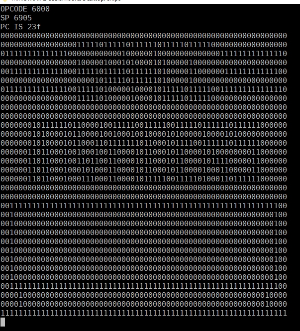

Chip 8 emulator for fun

make sure c++11 installed and windows.h existed on platform.

```sh
# To Build:
g++ -std=c++11 src/chip8.cpp src/debugger.cpp src/main.cpp -o deneme
```



Keypad interaction is not currently implemented